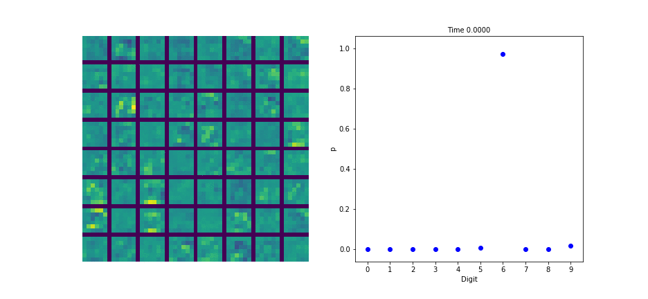
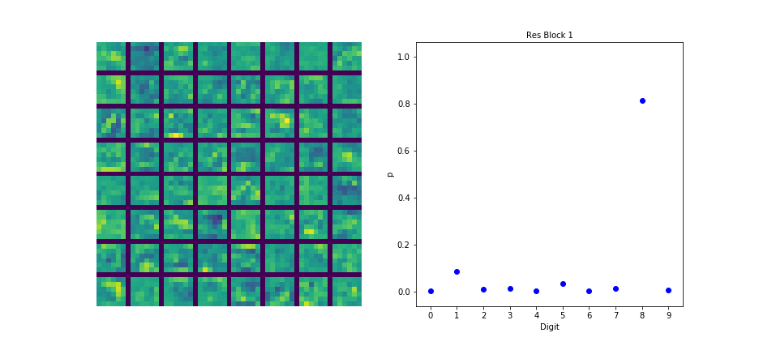

brew install mpich
pip install mpi4py


* experiment no time
* experiment single res block
* visualisations

# Further investigate
BatchNorm only works with time dependent ODE and not with time independent ODE?


* remove some parameters were different

# Installation
Install torchdiffeq from  https://github.com/rtqichen/torchdiffeq    
then   
``` pip install -r requirements.txt ```

# Usage 
This repository already comes with logs and weights which can be found in the directory  `cached_models`. 
In the Notebook `Demo.ipynb` these experiments are presented and visualised. 


To re-run all experiments delete or rename that directory and create a new empty one with the same name. 
Then you can either run `Demo.ipynb` or `python experiments.py` to recreate all experiments. 

# Results
Details can be found in `Demo.ipynb`.
### Reproduction of Results
* I successfully reproduced the entries "ResNet" and "ODE-Net" in Table 1 of [1] with some deviation of the exact errors.   
* I successfully reproduced Figure 3d in [1] qualitatively. 
* I tried to reproduce Figure 3c for 1e-3 tolerance. However, I found opposite results from what is reported in [1].

### Additional Experiments
* I tried a residual neural network architecture with the same number of parameters as the ODE-Net in [1]. 
This performed better and thus calls into question the authors claim that the ODE-Net is more parameter efficient.
* I tried an ODE-Net architecture where the dynamics function is not time dependent. This performed only slightly worse

### Visualisations
Continuous transformation of the hidden state in the ODE-Net with associated probabilities for the output label.


Discrete transformation of the hidden state in the ResNet with associated probabilities for the output label.
